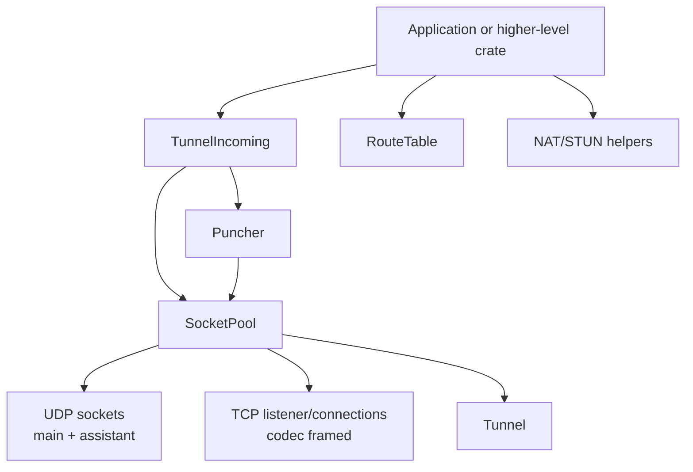

# rustp2p-core Design

This document describes the implemented `rustp2p-core` architecture. It is the
low-level transport and NAT traversal layer used by higher-level crates such as
`rustp2p-quic`.

`rustp2p-core` does not define a global peer identity model and does not encrypt
application payloads. Callers provide their own peer ids for `RouteTable<T>` and
their own application protocol on top of raw bytes.

## Architecture



The public entry point is `TunnelIncoming`. Internally it owns a `SocketPool`,
starts UDP/TCP reader tasks, and yields logical tunnels. `Puncher` is the
cloneable operational handle for raw UDP sends, socket queries, NAT discovery,
and punching. A `Tunnel` owns the receive side and send handle for one UDP
five-tuple or one TCP connection.

## Tunnel Incoming And Socket Pool

`TunnelIncoming::bind(Config)` creates:

- one main UDP socket when UDP is enabled;
- a TCP listener when TCP is enabled;
- UDP reader tasks that dispatch packets by `RouteKey`;
- TCP reader/writer tasks for each accepted connection;
- a `Puncher` backed by the same socket pool.

TCP uses an `InitCodec` to frame bytes. The default codec is length-prefixed.
UDP packets are delivered as received.

`TunnelIncoming::next()` returns a `Tunnel`. Applications read data with:

```rust
while let Some(data) = tunnel.recv().await {
    tunnel.send(data.freeze()).await?;
}
```

UDP uses `Protocol + socket.local_addr() + peer_addr` as its five-tuple key.
The first packet creates a tunnel and is queued before the tunnel is yielded.
Later packets for that key go to its bounded receive queue. A full queue drops
only that tunnel's datagram, so a slow consumer cannot block the shared socket.

Dropping a UDP tunnel unregisters exactly that tunnel instance; the next packet
for the same key creates a new tunnel. Dropping a TCP tunnel stops both I/O
tasks and closes the connection. TCP tunnels enter through TCP listener accepts or
the punching subsystem; `TunnelIncoming` does not expose an outbound connect API.

`Tunnel::split` consumes a tunnel and returns a single-owner `TunnelReadHalf`
plus a cloneable `TunnelWriteHalf`. Dropping the UDP read half unregisters its
five-tuple while existing write halves may continue sending. For TCP, dropping
each half independently stops its corresponding I/O direction.

## Puncher Socket Operations

`Puncher` allows callers to send raw UDP data and inspect socket state without
exposing internal socket management. It also owns NAT discovery and punching.

Important operations:

- `send_to(buf, addr)`: send through the main UDP socket.
- `try_send_via_all(buf, addr)`: send through all UDP sockets.
- `try_send_via_assistants(buf, addr)`: send through assistant UDP sockets.
- `local_addr()`, `assistant_count()`, and `udp_sockets()`: read-only socket
  state queries.

Assistant sockets are implementation detail for symmetric NAT probing. They are
managed through `Puncher::apply_nat_model`.

## Route Table

`RouteTable<T>` maps a caller-defined peer id to one or more `Route`s. A route is
identified by:

```text
RouteKey = Protocol + local SocketAddr + peer SocketAddr
```

Route metrics:

- `metric == 0`: direct route;
- `metric > 0`: relayed or multi-hop route according to the caller's protocol;
- `rtt`: route latency hint used by selection policies.

The route table stores route metadata only. It does not own sockets and does not
prove reachability by itself. Higher layers decide when a route is confirmed and
insert or remove it.

## NAT Information

`NatInfo` stores local and observed addressing metadata:

- `nat_type`: `Cone` or `Symmetric`;
- public IPv4 addresses and UDP/TCP ports;
- local IPv4 addresses and UDP/TCP ports;
- optional IPv6 address;
- configured mapping addresses;
- symmetric NAT public port range hints.

`Puncher::nat_info()` runs STUN against explicitly configured servers. Default
configuration contains no STUN servers.

`Puncher::apply_nat_model(nat_type)` does not run detection. It consumes the
local NAT type supplied by the caller:

- `Symmetric`: add assistant UDP sockets up to `max_assistant_sockets`;
- `Cone`: clean assistant UDP sockets.

This keeps NAT detection policy outside the socket model mutation API.

## Punching

`Puncher` performs low-level UDP/TCP hole-punching attempts using remote
`NatInfo` supplied through `PunchInfo`.

The local NAT model is supplied explicitly by higher layers. They should:

1. detect or learn the local `NatType`;
2. call `Puncher::apply_nat_model(local_nat_type)`;
3. exchange `NatInfo` with the remote peer using their own protocol;
4. call `Puncher::punch` or `Puncher::punch_now` with remote `NatInfo`.

`Puncher::need_punch` applies backoff based on previous attempts to the same
remote NAT address.

## Data Flow

### Receive

```text
UDP/TCP socket
  -> SocketPool reader task
  -> UDP five-tuple dispatcher or TCP connection queue
  -> TunnelIncoming::next()
  -> Tunnel::recv()
```

### Send

```text
Puncher::send_to / Tunnel::send
  -> SocketPool
  -> UDP socket or TCP connection
  -> network
```

### Route Use

```text
Tunnel
  -> RouteKey::from_tunnel()
  -> caller protocol confirms route
  -> RouteTable<T>::add_route(...)
  -> later send by selected RouteKey
```

`rustp2p-core` deliberately does not decide whether receiving a packet confirms
bidirectional reachability. That decision belongs to the caller's protocol.

## Defaults

- UDP and TCP default to port `0` unless configured.
- STUN server list defaults to empty.
- `max_assistant_sockets` defaults to `0`.
- Load balancing defaults to `MinHopLowestLatency`.
- Internal logs are debug-level unless a warning indicates a send, socket, or
  protocol problem.

## Relationship To rustp2p-quic

`rustp2p-quic` builds a PeerId QUIC overlay above this crate:

- `rustp2p-core` sends and receives raw bytes over UDP/TCP.
- `rustp2p-quic` defines the peer identity, protocol packets, discovery, relay,
  and end-to-end QUIC encryption.

Keep high-level user communication in `rustp2p-quic`; use `rustp2p-core` when
you need direct access to raw transport, route tables, or NAT traversal
primitives.
